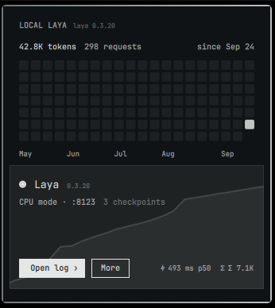

# Local Laya for Omarchy

An [Omarchy](https://omarchy.org) plugin that runs the [laya](https://github.com/NandhaKishorM/laya)
decision daemon — `laya-serve cpu` or `laya-serve gpu` — as a generated
systemd user unit, with status, stats and lifecycle controls in the bar.
It also wires the daemon into coding agents: an MCP stdio proxy plus
per-agent hooks let Claude, Codex, OpenCode and friends route decisions
through your local model. No laya checkout needed: the widget's
**Install laya** bootstraps a venv with `laya[serve]` + `mcp` into the
configured folder.



## What it does

- Generates `~/.config/systemd/user/omarchy-local-laya.service` from the
  configured folder and mode (`ExecStart=<folder>/laya-serve <mode>`).
- **Autostart** enables the unit for the user session — laya comes up at login.
- The bar widget shows state, uptime, port, loaded checkpoints and device
  (polled from `GET /health`), and offers **start / stop / restart**,
  a **cpu / gpu mode** switch (restarts the daemon), and an **autostart**
  toggle.
- **Installs laya for you**: with no `laya-serve` in the configured folder
  the widget shows an install card (`Install laya ›`), or run
  `omarchy-local-laya install` — it creates a venv, installs `laya[serve]`
  and `mcp` (uv when present, pip otherwise) and drops the bundled
  tooling (`laya-serve`, `serve.py`, `laya-mcp.py`, `laya-gate.py`,
  `laya-mcp-install`) in place. Existing files are never overwritten,
  so a real checkout keeps its own copies.
- **Agent wiring**: the bundled `laya-serve` runs the extended server
  (`serve.py`, which adds `POST /v1/systemone/batch`), and the
  `agents` verb runs `laya-mcp-install` — it registers the MCP proxy
  (`laya_status`, `laya_route`, `laya_filter`, `laya_triage`,
  `laya_yesno`, `laya_pick`, `laya_decide`) and installs the `laya-gate`
  hooks where the agent supports them. The More page's **AGENTS**
  section shows which of Claude, Codex, OpenCode, Copilot, Hermes,
  Crush, Pi and OMP are wired.
- **Updates**: `update` upgrades the installed package (`uv sync
  --upgrade-package` for uv projects, `uv pip`/`pip` for bare venvs);
  `update git` tracks upstream `main`.
- **Request stats**: the unit puts the plugin's `python/` on `PYTHONPATH`,
  so a `sitecustomize` hook accumulates per-session request count, errors,
  input/output tokens, latency (last + p50 of the last 64 calls), a
  cumulative-token series and per-checkpoint counts into
  `~/.local/state/omarchy/local-laya/stats.json`, plus a lifetime per-day
  rollup in `days.json`. Counters reset on `start`; days never do.
- **The widget** borrows the local-ai layout: a lifetime request grid with
  month labels and per-day hover, the daemon as a card with its cumulative
  token line, and a **More** page with the session graph, six figures
  (avg / p50 / errors / session / week / up), GPU telemetry (nvidia-smi),
  per-checkpoint request counts, and the mode / autostart / folder controls.
- If a manually-run `laya-serve` holds the port, the widget shows
  `external · pid N`; `start`/`stop`/`restart` release it (only when the
  listener is actually laya — a foreign service is left alone).
- `open log` tails `journalctl --user -fu omarchy-local-laya` in a terminal.

## Install

```sh
omarchy plugin add https://github.com/v3moreno/omarchy-local-laya --enable
```

Add the **Local Laya** widget to the bar (right section by default).

## Configuration

Defaults: folder `~/Projects/local-laya`, mode `cpu`, autostart off.

From the CLI (`~/.config/omarchy/plugins/v3moreno.local-laya/bin/omarchy-local-laya`):

```sh
omarchy-local-laya snapshot            # JSON state the widget draws
omarchy-local-laya start | stop | restart
omarchy-local-laya mode cpu            # or gpu — restarts if running
omarchy-local-laya folder ~/code/laya  # must contain an executable laya-serve
omarchy-local-laya autostart on|off
omarchy-local-laya install             # venv + laya[serve] + laya-serve into the folder
omarchy-local-laya update              # PyPI: uv sync, uv pip or pip as the folder allows
omarchy-local-laya update git          # install upstream main instead
omarchy-local-laya agents              # wire MCP + hooks into every installed agent
omarchy-local-laya agents claude       # or a subset — output saved to agents.txt
omarchy-local-laya env                 # show <folder>/laya.env
omarchy-local-laya env LAYA_THREADS=8  # set a LAYA_* key (restarts if running)
omarchy-local-laya log
```

Config persists at `~/.local/state/omarchy/local-laya/config.json`. A
`LAYA_PORT` in the folder's `laya.env` overrides the per-mode port
(8123 cpu / 8124 gpu) used for the health probe.

## Tuning

`laya-serve` sources `<folder>/laya.env`, so any `LAYA_*` variable applies
(`env` verb edits it):

- `LAYA_THREADS` — torch intra-op threads for CPU inference; keep at or
  under physical cores (default here: 8).
- `LAYA_INTEROP=0` — disables the plugin's `torch.set_num_interop_threads(1)`
  pin. The pin is on by default because laya serves one forward pass per
  call, where upstream's own benchmarks measured idle inter-op parallelism
  costing ~12x latency.
- `LAYA_FAST=1` — runs each checkpoint on the TileLang fast path
  (`laya[fast]`, GPU only) via an `on_load` hook; needs
  `uv pip install --python .venv/bin/python "laya[fast]==0.3.20"` in the folder.
- `LAYA_CPU_AMP=bf16`, `LAYA_MODELS`, `LAYA_AUTO_TASK`, `LAYA_API_KEY` —
  pass through to `laya.serve` unchanged.

IPC:

```sh
qs ipc -n -p "$OMARCHY_PATH/shell" call v3moreno.local-laya menu
```

## Requirements

`systemctl --user`, `curl`, `jq` and `python3` (or `uv`, preferred). The
daemon itself comes from PyPI's `laya[serve]==0.3.20` (pinned per plugin
release) — `install` fetches it, so
no existing checkout is required. An existing folder works too: point
`folder` at anything containing an executable `laya-serve` that takes
`cpu`/`gpu` (the [local-laya](https://github.com/v3moreno/local-laya)
checkout works as-is). The daemon's `GET /health` is used unauthenticated
on `127.0.0.1`.

## Uninstall

```sh
omarchy-local-laya stop
systemctl --user disable omarchy-local-laya.service
omarchy plugin remove v3moreno.local-laya
```

The generated unit (`~/.config/systemd/user/omarchy-local-laya.service`),
state (`~/.local/state/omarchy/local-laya/`) and the laya folder itself
can then be deleted safely.

## License

MIT
